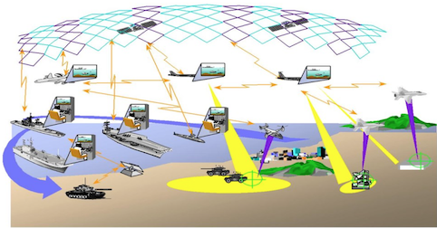

01-FFI_Android
==

Situation awareness and incident reporting
--

###Essential to Network Based Defense (NBD) is the concept of service orientation and the responsibility to share.
- A current trend is increased use of consumer electronics for military applications.
- Smart-devices constitute a cheap yet powerful sensor, processing and communication platform.

####task
- Implement an app for situation awareness and reporting incidents others.
- The app must function in a Disconnected, Intermittent, Limited (DIL) environment.